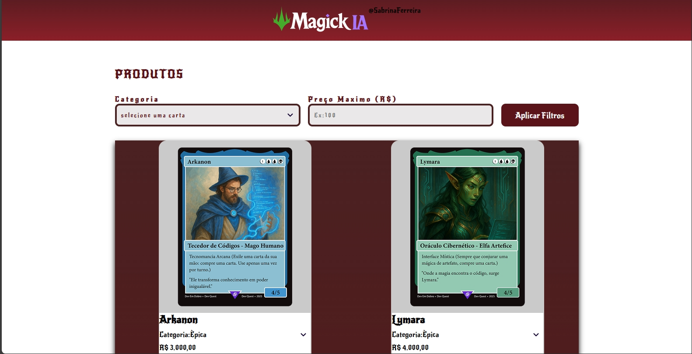

# 📌 Projeto: MagickAI

## 📖 Descrição

O **MagickAI** é uma aplicação web desenvolvida para demonstrar funcionalidades interativas e visuais, muitas vezes integradas a algum tipo de processamento inteligente ou experiência com efeitos “mágicos” baseados em lógica e estilo. O projeto foi construído como uma forma de praticar e consolidar conhecimentos de **HTML, CSS e JavaScript**, além de explorar implementação de lógicas dinâmicas no navegador.

A interface foi projetada para proporcionar uma experiência visual envolvente, com elementos interativos que respondem à interação do usuário, reforçando conceitos de **manipulação do DOM**, estados visuais e comportamento responsivo.

Este projeto enfatiza os fundamentos do desenvolvimento front-end, reforçando a organização de código, estilização moderna e boas práticas de usabilidade sem o uso de frameworks externos.

---

## 👀 Preview

> Imagem ilustrativa da interface do MagickAI com elementos visuais e interações do usuário.

---

## ⚙️ Funcionalidades (exemplos)

- Interface interativa com elementos que respondem à ação do usuário  
- Uso de **manipulação do DOM** com JavaScript  
- Estilização visual com efeitos e transições  
- Layout responsivo que se adapta a diferentes tamanhos de tela  
- Organização de código sem frameworks externos

> *Ajuste essa seção para refletir as funcionalidades reais do projeto.*

---

## 🛠️ Tecnologias Utilizadas

- **HTML5** — Estrutura semântica da aplicação  
- **CSS3** — Estilização, layout, transições e efeitos visuais  
- **JavaScript (ES6+)** — Lógica interativa e manipulação de elementos  
- **Recursos visuais e efeitos** — (adicione bibliotecas ou técnicas usadas, se houver)

---

## 🔗 Links

- Repositório do projeto:  
  https://github.com/SabrinaFerreiraDev/PROJETOS_PESSOAIS/tree/main/projeto-magickai

## 🌐 Demo ao vivo

Acesse a demonstração pública:  
  https://projetos-pessoais-v19u-7zt1hpl61-sabrinaferreiradevs-projects.vercel.app/

