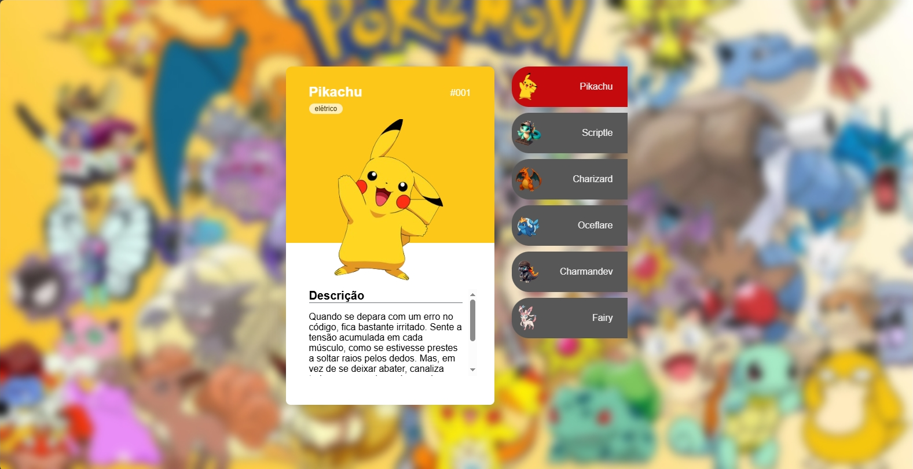

# 📌 Projeto: Pokedev

## 📖 Descrição

O **Pokedev** é uma aplicação web desenvolvida para simular uma **Pokédex interativa**, permitindo visualizar informações detalhadas de Pokémon de forma dinâmica e organizada. O projeto utiliza dados reais consumidos diretamente da **PokéAPI**, garantindo informações atualizadas e fiéis ao universo Pokémon.

A aplicação foi criada com foco no **desenvolvimento front-end**, explorando conceitos como manipulação do DOM, requisições assíncronas e renderização dinâmica de dados no navegador. A interface apresenta os Pokémon de forma visual, facilitando a navegação e a compreensão das informações, além de reforçar boas práticas de **UI e experiência do usuário**.

Este projeto tem como objetivo principal o **aprendizado prático de JavaScript**, integrando lógica de programação, consumo de APIs REST e organização de código, sem o uso de frameworks, fortalecendo os fundamentos do desenvolvimento web.

---

## 👀 Preview

> Imagem ilustrativa da interface da aplicação exibindo os Pokémon e suas informações principais.

---

## ⚙️ Funcionalidades

- Consumo de dados da **PokéAPI**
- Renderização dinâmica de informações no navegador
- Exibição visual de Pokémon (nome, imagem e dados)
- Manipulação do DOM com JavaScript puro
- Estrutura de código organizada

---

## 🛠️ Tecnologias Utilizadas

- **HTML5** — Estrutura semântica da aplicação  
- **CSS3** — Estilização, layout e organização visual  
- **JavaScript (ES6+)** — Lógica da aplicação, consumo da API e manipulação do DOM  
- **PokéAPI** — Fonte de dados dos Pokémon

---

## 🔗 Links

- Acessar Site:
  [site](https://projeto-pokedex-kappa.vercel.app/)
- Repositório do projeto:  
  https://github.com/SabrinaFerreiraDev/PROJETOS_PESSOAIS/tree/main/projeto-pokedev

